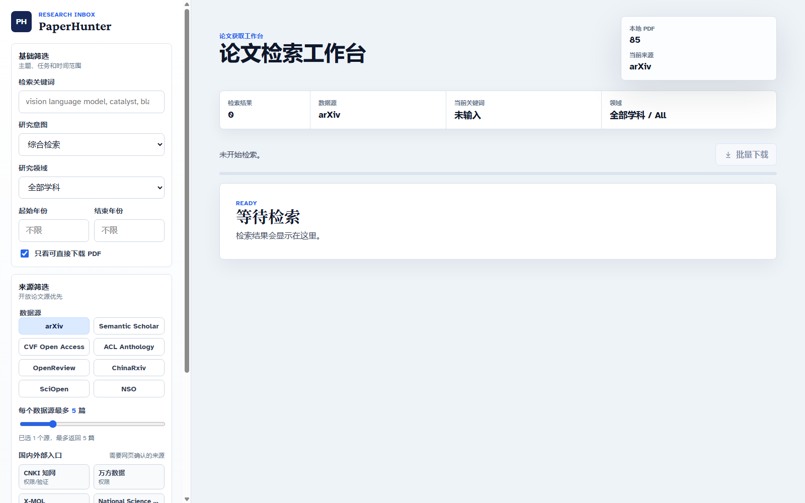

<div align="center">
  <h1>PaperHunter</h1>
  <p><strong>A local research paper discovery and PDF download workspace for researchers.</strong></p>
  <p>
    English · <a href="README.zh-CN.md">简体中文</a>
  </p>
  <p>
    <a href="LICENSE"></a>
    <a href="https://github.com/Jia0808/PaperHunter/actions/workflows/ci.yml"></a>
    
    
  </p>
</div>



## Why PaperHunter

PaperHunter helps researchers search across multiple open paper sources, filter results with research-oriented controls, and download public open-access PDFs into a local folder. It is designed as a practical literature discovery tool rather than a crawler that bypasses access controls.

The project uses a plain Python backend and a native HTML/CSS/JavaScript frontend. It does not require a database, account system, or cloud service.

## Highlights

- Multi-source search across international and domestic open sources.
- Research-friendly filters for intent, field, year range, author, venue, match scope, arXiv category, and downloadable-only results.
- Per-source result limits, so one large source does not dominate the list.
- Local PDF download with duplicate detection.
- Local paper inbox for favorites, ignored papers, reading status, tags, notes, recent searches, download status, and full-text translation state, stored in `data/library.json`.
- Model settings panel for OpenAI-compatible Responses/Chat Completions endpoints, DeepSeek, Anthropic, and custom providers.
- Abstract translation for a single paper or a batch of favorites, with stale-translation detection when source abstracts change.
- Zotero round-trip integration: save discovered records to Zotero, import local Zotero records and PDF attachments, and sync PaperHunter translations and status tags back through the PaperHunter Zotero Bridge.
- BibTeX, RIS for Zotero/EndNote, Markdown reading-list, and bilingual English/Chinese summary exports for saved favorites or individual papers.
- Full-text translation for downloaded PDFs, with resumable chunk tasks, progress tracking, bilingual Markdown output, and an action to open the translated file location.
- Favorite metadata refresh to update older saved records and recover full abstracts when available; ChinaRxiv results can hydrate truncated feed abstracts from detail pages.
- Workspace backup and import for local library data, downloads, translated papers, and translation tasks. API keys are stripped from backups.
- External gateway buttons for Google Scholar, CNKI, Wanfang, X-MOL, Nature, Science, and other sources that usually require login, institutional permission, payment, robots.txt restrictions, or CAPTCHA.
- Local-first workflow: downloaded PDFs stay under `downloaded_papers/`, translated Markdown stays under `translated_papers/`, and library/settings state stays under `data/`; these runtime paths are ignored by Git.
- Lightweight stack: Python 3.12, `requests`, `arxiv`, and browser-native frontend code.

## Supported Sources

| Source | Search | PDF Download | Notes |
| --- | --- | --- | --- |
| arXiv | Yes | Yes | Uses the arXiv package/API. |
| Semantic Scholar | Yes | Public open PDFs only | Subject to Semantic Scholar rate limits. |
| CVF Open Access | Yes | Yes | Searches public CVF Open Access pages. |
| ACL Anthology | Yes | Yes | Uses ACL Anthology metadata/cache. |
| OpenReview | Yes | Public open PDFs only | Some PDFs may require validation by the host. |
| ChinaRxiv / ChinaXiv | Yes | Public open PDFs only | Domestic open paper source; detail pages are used when feed abstracts are truncated. |
| SciOpen | Yes | Public open PDFs only | Domestic/open-access source. |
| National Science Open | Yes | Public open PDFs only | Open journal source. |
| Google Scholar, CNKI, Wanfang, X-MOL, Nature, Science | External gateway only | No automated download | These sources may require manual browsing, login, authorization, payment, robots.txt compliance, or human verification. |

## Quick Start

Python 3.12 or newer is recommended.

```bash
python -m venv venv
venv\Scripts\activate
pip install -r requirements.txt
python app.py
```

Then open:

```text
http://127.0.0.1:8000
```

On Windows, you can also run:

```bat
start_paperhunter.bat
```

## Model Configuration

PaperHunter can translate abstracts and downloaded full text through a model endpoint that you configure locally in the UI.

Supported presets include:

- APIXIN GPT-compatible endpoints
- DeepSeek Chat Completions
- Anthropic Messages
- custom OpenAI-compatible Responses or Chat Completions endpoints

Model settings are saved to `data/settings.json`, which is ignored by Git. The public status API returns only a masked key, and workspace backups intentionally remove the API key before writing `data/settings.json` into the backup ZIP.

Translation requests send the selected abstract or full-text chunk to the configured model provider. PaperHunter does not query your account balance and does not send papers for translation unless you trigger a translation action.

If an OpenAI-compatible Responses endpoint returns a completed response without visible text, PaperHunter retries the request through the matching Chat Completions route when that fallback can be inferred. This keeps gateway providers usable when they support both APIs but expose model output only through Chat Completions.

## Stage 8 Validation Notes

The end-to-end acceptance path is: import a user-visible ScienceDirect or Web of Science alert, adopt the complete alert abstract from the Alert inbox, translate the abstract, translate a downloaded PDF into bilingual Markdown, generate the Research Radar smart brief, and verify the Zotero binding is still intact.

Validation should use temporary `LIBRARY_PATH`, `SETTINGS_PATH`, `FULLTEXT_TASK_DIR`, `DOWNLOAD_DIR`, and `TRANSLATED_DIR` paths. A real PDF may be selected from `downloaded_papers/`, but the test must not clear or overwrite the real PaperHunter library, downloaded papers, translated papers, or Zotero data.

The permission boundary is intentional: PaperHunter does not bypass paywalls or automate restricted publisher access, but it must not remove a user's legitimate route when they already have access. User-visible alert text, local Zotero records, and locally owned PDFs are valid inputs even when open metadata sources are missing, delayed, or stale for a new journal or record.

## Stage 9 Runtime Health

The "Runtime Health" panel is a read-only troubleshooting center for the Stage 8 flow. It summarizes model configuration, the most recent explicit model connection test, resumable full-text translation tasks, Zotero binding state, and acceptance checks.

The model card keeps the last connection-test record in `data/settings.json`: status, tested time, API type, fallback API type when Responses fell back to Chat Completions, final URL, response text length, usage, and normalized error text. This record is updated only when you click the model test or run a translation path that already calls the model.

The full-text card lists recent chunked translation tasks. Failed or partial tasks can be resumed from the panel when the paper is still in the local library, and completed tasks can open the translated Markdown file location.

The Zotero card shows a dry-run plan for favorite papers: canonical `itemKey`, whether abstract/full-text translations exist, how many `paperhunter:*` tags would be managed, and how many translated Markdown attachments would be linked. The single-paper dry-run opened from this panel passes `persistReview: false`, so it does not write Zotero, does not create audit events, and does not persist ambiguous binding review state. Real Zotero write-back still requires the normal explicit sync action.

Refreshing diagnostics does not call the model, does not read Zotero candidate records, does not write Zotero audit history, and does not clear PA/ZO, downloaded papers, translated papers, or Zotero data.

## Reference Managers

PaperHunter can save search results, favorites, or a single paper directly to a running Zotero desktop app through Zotero's local Connector endpoint. It can also export RIS files for Zotero, EndNote, and other reference managers. The saved/exported records carry title, authors, year/date, venue, abstract, DOI when available, source URL, public PDF URL when available, keywords, and notes.

If Zotero is installed locally, PaperHunter can import records, tags, collections, and PDF attachment paths from a read-only snapshot of `~/Zotero/zotero.sqlite`. Imported Zotero PDFs are treated as user-owned library files: they do not have to be open access, and PaperHunter does not try to bypass access controls to fetch restricted full text.

After saving to Zotero or importing from Zotero, PaperHunter matches the same paper by DOI, source URL, source identifier, and title/year, then writes the Zotero `itemKey` back into the local paper record. This keeps a paper linked even when it was first collected in PaperHunter and only later saved to Zotero.

To sync PaperHunter results back to Zotero, install the local plugin package downloaded from the Zotero integration panel in PaperHunter. The XPI is built from the tracked `zotero-bridge/manifest.json` and `zotero-bridge/bootstrap.js` sources when needed, and the built package is paired to the current PaperHunter instance with a local token. The bridge exposes local `/paperhunter/ping` and `/paperhunter/sync` endpoints inside Zotero, creates or updates the single PaperHunter-managed "PaperHunter sync result" note under the Zotero item, applies only `paperhunter:*` status tags, and links translated Markdown files under PaperHunter's `translated_papers/` output as local attachments. It does not delete, overwrite, or move Zotero's original items, PDFs, user notes, user tags, or collections.

The intended user flow is: install and open Zotero, start PaperHunter, import existing Zotero records/PDF attachment paths into PaperHunter when needed, translate or summarize in PaperHunter, then install/enable the optional PaperHunter Zotero Bridge if you want those PaperHunter results written back into Zotero. Zotero remains the source of truth for the original library contents.

For non-open-access papers, PaperHunter treats the reference record and the PDF as separate things: it can keep metadata, DOI, and external gateway links, but it does not bypass paywalls, login, CAPTCHA, institutional access controls, or publisher restrictions. If you obtain a PDF through your own legal access path, you can still manage and translate that local file in the PaperHunter workflow.

For the full Alert-to-Zotero workflow, including Alert inbox import, adopt/lock, translation, Zotero import/save, Bridge installation, dry-run, and real write-back, see the Chinese guide: [Zotero and Alert workflow](docs/ZOTERO_ALERT_WORKFLOW.zh-CN.md).

### Installing PaperHunter Zotero Bridge

The bridge is a local Zotero plugin. It does not modify Zotero source code. Users install Zotero normally, run PaperHunter normally, and only install the optional bridge when they want PaperHunter translations written back into Zotero.

1. Click "Download Bridge plugin" in the PaperHunter Zotero integration panel. If the XPI is missing or stale, PaperHunter rebuilds it from the tracked bridge source files.
2. Open Zotero's plugin/add-ons manager.
3. Choose the option to install an add-on from a file, then select `paperhunter-zotero-bridge.xpi`.
4. Restart Zotero.
5. Refresh PaperHunter or restart it. The Zotero panel should show `Bridge 0.2.2 available`, the pairing token should be verified, and write-back should become available.

If the panel still says the bridge is required, make sure Zotero is running, reinstall the current XPI, and restart Zotero. If it reports a version, protocol, or pairing-token mismatch, download the XPI from the current PaperHunter page and install it again so the embedded pairing token matches this workspace. Moving to another machine or restoring settings creates a new local pairing token, so reinstall the freshly downloaded XPI in Zotero. The bridge only accepts local PaperHunter requests with the matching pairing token and only updates the PaperHunter-managed sync note, `paperhunter:*` tags, and translated Markdown attachment; existing Zotero items, PDFs, tags, notes, and collections are preserved.

## Typical Workflow

1. Enter a research keyword or phrase.
2. Select research intent, field, year range, source group, and per-source limit.
3. Run the search and review metadata, venues, years, and PDF availability.
4. Save useful papers to the local inbox, ignore papers you do not want to see again, and optionally add reading status, tags, or notes.
5. Configure a model endpoint if you want abstract or full-text translation.
6. Translate one abstract, batch-translate favorite abstracts, or retranslate stale summaries after metadata changes.
7. Save records to Zotero, or import existing Zotero library items and PDF attachments.
8. Download selected open-access PDFs or batch-download downloadable results.
9. Translate downloaded full text into bilingual Markdown, monitor chunk progress, and open the output folder when the task is complete.
10. Enable the PaperHunter Zotero Bridge to sync abstract translations, full-text translation attachments, and status tags back to Zotero.
11. Export saved favorites as BibTeX, RIS for Zotero/EndNote, a Markdown reading list, or a bilingual English/Chinese summary file.
12. Refresh favorite metadata when older saved items show truncated abstracts.
13. Export a workspace backup before moving machines or cleaning local runtime data.
14. Use external gateway buttons when a source needs browser-side login or institution access.

## Project Structure

```text
app.py                    Python HTTP server, source adapters, filters, downloads
web/index.html            Browser UI structure
web/styles.css            UI styling
web/app.js                Frontend state, filters, API calls
data/                     Local library, model settings, and task state, ignored by Git
data/fulltext_tasks/      Resumable full-text translation task state, ignored by Git
downloaded_papers/        Local PDF output directory, ignored by Git
translated_papers/        Bilingual Markdown full-text translation output, ignored by Git
zotero-bridge/            Local Zotero plugin source; the XPI is rebuilt from these files when needed
docs/assets/              README and documentation images
tests/                    Backend regression tests
.github/workflows/ci.yml  Syntax checks for Python and JavaScript
```

## Development Checks

```bash
python -m py_compile app.py
python -m unittest discover -s tests
node --check web/app.js
```

## Local Data and Backups

PaperHunter is local-first, but some actions intentionally call external services:

- search requests call the selected public paper sources
- abstract and full-text translation requests call the model endpoint you configured
- external gateway buttons open third-party websites in your browser

Local runtime data is ignored by Git:

- `data/library.json` stores favorites, ignored papers, metadata, tags, notes, translations, and recent searches
- `data/settings.json` stores local model settings and may contain an API key
- `data/fulltext_tasks/` stores resumable translation task progress
- `downloaded_papers/` stores downloaded PDFs
- `translated_papers/` stores bilingual Markdown full-text translations
- `output/`, `test-results/`, `tmp-*.png`, and `zotero-bridge/*.xpi` are local verification/build artifacts

The workspace backup feature exports local library data, downloaded PDFs, translated papers, and full-text task state. It includes model settings without the API key, so API credentials must be re-entered after restoring a backup.

## Compliance

PaperHunter only attempts automated downloads from open PDF URLs or public open-access endpoints. It does not bypass paywalls, authentication, CAPTCHA, institutional access controls, or publisher restrictions.

Sources such as Google Scholar, CNKI, Wanfang, X-MOL, Nature, Science, and similar websites may require manual browsing, login, institutional authorization, payment, robots.txt compliance, or human verification. PaperHunter exposes them only as external browser entry points where appropriate.

See [DISCLAIMER.md](DISCLAIMER.md) for details.

## Repository Safety

If you publish this repository on GitHub, review [docs/REPOSITORY_SAFETY.md](docs/REPOSITORY_SAFETY.md). At minimum:

- enable two-factor authentication on the owner account
- protect the `main` branch
- disallow force pushes and branch deletion
- avoid granting collaborator `Admin` permissions unless necessary
- keep a local mirror backup

## Contributing

Issues and pull requests are welcome. Please keep source integrations compliant with each website's terms of service and avoid adding logic that bypasses access restrictions.

See [CONTRIBUTING.md](CONTRIBUTING.md) for the contribution guide and [SECURITY.md](SECURITY.md) for security reporting.

## License

Apache License 2.0. See [LICENSE](LICENSE).
